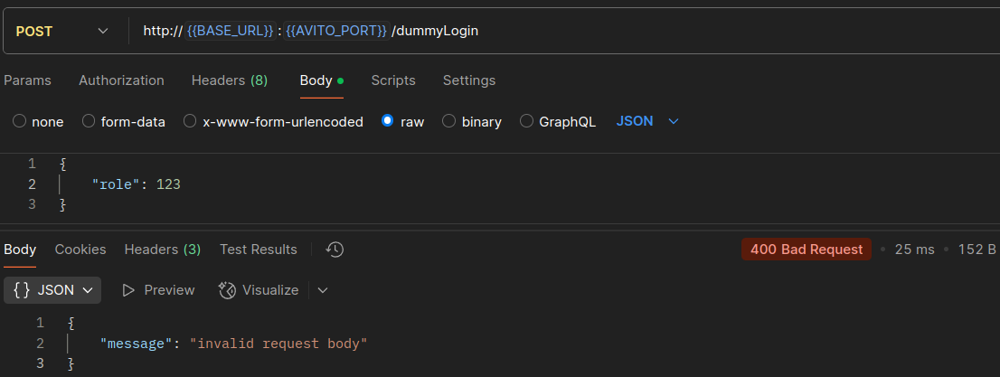

# pvz-service

Это тестовое задание в рамках отбора на летнюю стажировку в компанию Avito на позицию Trainee Backend Engineer.

- [pvz-service](#pvz-service)
	- [TODO](#todo)
	- [Подход к решению задания](#подход-к-решению-задания)
	- [Почему net/http?](#почему-nethttp)
	- [Архитектура](#архитектура)
	- [Обработка ошибок](#обработка-ошибок)
	- [Архитектура базы данных](#архитектура-базы-данных)
	- [Логирование](#логирование)
	- [Установка и запуск](#установка-и-запуск)
		- [Первый вариант](#первый-вариант)
		- [Второй вариант (Docker)](#второй-вариант-docker)
	- [Тестирование](#тестирование)
		- [Ручное тестирование](#ручное-тестирование)
			- [POST /dummyLogin](#post-dummylogin)
			- [POST /register](#post-register)
			- [POST /login](#post-login)
			- [POST /pvz](#post-pvz)
			- [POST /receptions](#post-receptions)
			- [POST /products](#post-products)
			- [GET /pvz?startDate=2024-10-25\&endDate=2029-01-02\&page=1\&limit=10](#get-pvzstartdate2024-10-25enddate2029-01-02page1limit10)
			- [POST /pvz/:id/close\_last\_reception](#post-pvzidclose_last_reception)
			- [POST /pvz/:id/delete\_last\_product](#post-pvziddelete_last_product)
	- [Вопросы](#вопросы)

## TODO

- [x] Продумать архитектуру сервиса
- [x] Написать доменные сущности
- [x] Написать репозитории
- [x] Написать имплементации репозиториев
- [x] Написать миграции базы
- [x] Реализовать все нужные `middleware` (`auth`, `logger`, `panic`)
- [x] Реализовать все обработчики
- [x] Добавить логи
- [x] Добавить метрики
- [x] Написать unit-тесты для сервисов
- [x] Написать интеграционные тесты
- [x] Добавить gRPC
- [x] Написать тесты для обработчиков
- [ ] Написать нагрузочные тесты (опционально, не требуется в задании)
- [x] Провести полное ручное тестирование всех сценариев
- [x] Написать Dockerfile и docker-compose.yml

## Подход к решению задания

Я решил не использовать кодогенерацию с помощью условного `oapi-codegen`, так как хотел полный контроль над разработкой всех частей сервиса.

Решил поэкспериментировать и не использовать сторонние библиотеки для роутинга (`echo`/`chi`/`gorilla`/`gin` etc), а использовать только `net/http`. Что ж я могу сказать, мне понравился этот опыт.

## Почему net/http?

С версии `go 1.22` `net/http` теперь поддерживает хороший роутинг, хороший `middleware-chaining`, поэтому я не видел смысла тянуть лишние зависимости в сервис. 

## Архитектура

В последнее время я придерживаюсь принципа **DRY**, поэтому использовал здесь **DDD** подход. Во главе всего стоит `domain` - доменные сущности и репозитории. API обращается к сервисам, сервисы "ходят" в домен и в хранилище.

Каждый сервис ограничен своим набором методов, которые он может выполнять с хранилищем.

На каждый набор ручек есть свой `Handler`, который содержит все нужные обработчики.

Я отказался от `go-playground/validator` и написал для каждого `<name>Params` свой метод `Validate()`, который валидирует поля этого `Params`. Это позволяет четко определить бизнес-правила валидации + быстрее, чем валидация через рефлексию. 

## Обработка ошибок

Самый сложный момент был для меня, потому что
1. В спецификации не указаны `500` коды, а значит надо отдавать максимум `400/403`.
2. Ошибки в спецификации - обычная `Error` структура с полем `Message` без каких-либо своих внутренних кодов или деталей.
3. А где определить ошибки? Я решил, что надо все ошибки определить на уровне домена, так как это бизнес правила по сути. А значит все слои точно будут обращаться к уровню домена.

Но в итоге я пришел к тому, что буду отдавать `wrapped` ошибку из всех "крайних" функций/методов (тех, которые вызываются в самом конце стека), а наверх буду тянуть уже `return err`. В слое API я просто сделал `errors.Is()` через `switch`.

Думаю, что такое решение валидное.

## Архитектура базы данных

Ничего сложного, всего 4 таблицы:

1. `users`
2. `pvz`
3. `receptions`
4. `products`

Еще индексы для ускоренного поиска. Например, индекс для поиска открытой приемки, индекс для поиска приемки по `pvz_id` и тд.

## Логирование

Я использовал для логов `zerolog` как новую для меня библиотеку. Логи пишутся в файл, каждая `feature` имеет свой логгер с названием этой фичи. 

## Установка и запуск

Есть два варианта:

1. `go run` and leeeets go. Или же через `make`
2. `docker`

### Первый вариант

1. Склонировать репозиторий

```sh
https://github.com/0x0FACED/pvz-avito.git
```

2. Перейти в корень репозитория.
3. Создать `.env`, скопировав в него содержимое из `.env.example` и поменяв некоторые переменные.
4. Выполнить `make build-run` или `go run cmd/app/main.go`.
5. Профит!

### Второй вариант (Docker)

Первые 3 шага аналогичны предыдущему способу.

Далее:

1. Отредактировать `Dockerfile` и `docker-compose.yaml`, если требуется.
2. Запуск через `docker compose up --build`, если нужны логи или `docker docker compose up -d`, чтобы запустить демона.

```sh
docker compose up --build
```
```sh
docker compose up -d
```

3. Профит! Сервер доступен по адресу `http://localhost:8080`. Метрики доступны на порту 9000, если `.env` не был изменен.

## Тестирование

Я написал unit-тесты для всех сервисов + всех обработчиков и еще немного для `Validate()` методов параметров и крипто функций. Запустить их можно через `make run-tests` или же скопировав команду из `Makefile`

Итоговое покрытие тестами:

```sh
        github.com/0x0FACED/pvz-avito/cmd/app           coverage: 0.0% of statements
        github.com/0x0FACED/pvz-avito/internal/app              coverage: 0.0% of statements
ok      github.com/0x0FACED/pvz-avito/internal/auth/application (cached)        coverage: 90.9% of statements
ok      github.com/0x0FACED/pvz-avito/internal/auth/delivery/http       (cached)        coverage: 81.2% of statements
        github.com/0x0FACED/pvz-avito/internal/auth/domain              coverage: 0.0% of statements
        github.com/0x0FACED/pvz-avito/internal/auth/infra/postgres              coverage: 0.0% of statements
        github.com/0x0FACED/pvz-avito/internal/auth/mocks               coverage: 0.0% of statements
        github.com/0x0FACED/pvz-avito/internal/pkg/config               coverage: 0.0% of statements
        github.com/0x0FACED/pvz-avito/internal/pkg/database             coverage: 0.0% of statements
        github.com/0x0FACED/pvz-avito/internal/pkg/httpcommon           coverage: 0.0% of statements
        github.com/0x0FACED/pvz-avito/internal/pkg/logger               coverage: 0.0% of statements
?       github.com/0x0FACED/pvz-avito/internal/pkg/metrics      [no test files]
        github.com/0x0FACED/pvz-avito/internal/pkg/middleware           coverage: 0.0% of statements
ok      github.com/0x0FACED/pvz-avito/internal/product/application      (cached)        coverage: 100.0% of statements
ok      github.com/0x0FACED/pvz-avito/internal/product/delivery/http    (cached)        coverage: 95.0% of statements
        github.com/0x0FACED/pvz-avito/internal/product/domain           coverage: 0.0% of statements
        github.com/0x0FACED/pvz-avito/internal/product/infra/postgres           coverage: 0.0% of statements
        github.com/0x0FACED/pvz-avito/internal/product/mocks            coverage: 0.0% of statements
ok      github.com/0x0FACED/pvz-avito/internal/pvz/application  (cached)        coverage: 91.4% of statements
        github.com/0x0FACED/pvz-avito/internal/pvz/delivery/grpc                coverage: 0.0% of statements
        github.com/0x0FACED/pvz-avito/internal/pvz/delivery/grpc/v1             coverage: 0.0% of statements
ok      github.com/0x0FACED/pvz-avito/internal/pvz/delivery/http        0.012s  coverage: 86.7% of statements
        github.com/0x0FACED/pvz-avito/internal/pvz/domain               coverage: 0.0% of statements
        github.com/0x0FACED/pvz-avito/internal/pvz/infra/postgres               coverage: 0.0% of statements
        github.com/0x0FACED/pvz-avito/internal/pvz/mocks                coverage: 0.0% of statements
ok      github.com/0x0FACED/pvz-avito/internal/reception/application    (cached)        coverage: 100.0% of statements
ok      github.com/0x0FACED/pvz-avito/internal/reception/delivery/http  (cached)        coverage: 90.0% of statements
        github.com/0x0FACED/pvz-avito/internal/reception/domain         coverage: 0.0% of statements
        github.com/0x0FACED/pvz-avito/internal/reception/infra/postgres         coverage: 0.0% of statements
        github.com/0x0FACED/pvz-avito/internal/reception/mocks          coverage: 0.0% of statements
ok      github.com/0x0FACED/pvz-avito/tests/integration 1.089s  coverage: 76.1% of statements
```

Все важные методы/функции покрыты тестами.

### Ручное тестирование

Окей, у нас есть пустая база данных, будем ее заполнять. Для ручного тестирования использовался `Postman`.

#### POST /dummyLogin

В первую очередь проестируем самую простую ручку - `/dummyLogin`.

Сначала сделаем тест для получения токена с ролью `moderator`:


Декодируем его, чтобы узнать, правильный ли токен нам подсунул сервер:


Теперь сделаем токен с ролью `employee`:


Декодируем:


Сделаем парочку невалидных запросов.

Невалидная роль:


Неверный JSON запрос:



Пустой запрос:


#### POST /register

Далее я не буду рассматривать невалидные запросы, так как слишком много картинок надо вставлять.

Регистрируемся:


#### POST /login

Логинимся:


#### POST /pvz

Создадим pvz за модератора:


Используем далее этот `UUID` для остальных запросов.

#### POST /receptions

Создадим приемку:


#### POST /products

Добавим ~20 товаров:


В базе теперь:


#### GET /pvz?startDate=2024-10-25&endDate=2029-01-02&page=1&limit=10

Получим pvz с приемками с товарами:

```json
[
    {
        "pvz": {
            "id": "48118e83-a508-40ff-92b4-1351d8f244bc",
            "registrationDate": "2025-04-12T20:55:21.505442Z",
            "city": "Казань"
        },
        "receptions": [
            {
                "reception": {
                    "id": "dce495a0-da35-49a8-8c94-99f645049761",
                    "dateTime": "2025-04-12T20:56:18.048076Z",
                    "pvzId": "48118e83-a508-40ff-92b4-1351d8f244bc",
                    "status": "in_progress"
                },
                "products": [
                    {
                        "id": "47de7016-9ecd-4ac0-bcb7-b69e031346c8",
                        "dateTime": "2025-04-12T20:57:24.561044Z",
                        "type": "электроника",
                        "receptionId": "dce495a0-da35-49a8-8c94-99f645049761"
                    },
                    {
                        "id": "2b592d41-0ce7-4973-be59-034b5b755d64",
                        "dateTime": "2025-04-12T20:57:24.104197Z",
                        "type": "электроника",
                        "receptionId": "dce495a0-da35-49a8-8c94-99f645049761"
                    },
                    {
                        "id": "15764e2f-359e-4148-99ff-0e1c4d71b92b",
                        "dateTime": "2025-04-12T20:57:23.594739Z",
                        "type": "электроника",
                        "receptionId": "dce495a0-da35-49a8-8c94-99f645049761"
                    },
                    {
                        "id": "2a4bebe3-490c-4d4d-a65a-ab2639a18c7d",
                        "dateTime": "2025-04-12T20:57:23.117541Z",
                        "type": "электроника",
                        "receptionId": "dce495a0-da35-49a8-8c94-99f645049761"
                    },
                    {
                        "id": "125d8536-1155-436c-aa36-302830d06798",
                        "dateTime": "2025-04-12T20:57:22.663868Z",
                        "type": "электроника",
                        "receptionId": "dce495a0-da35-49a8-8c94-99f645049761"
                    },
                    {
                        "id": "dbd4ab41-f919-4ecf-9b8c-9b4b5bf89815",
                        "dateTime": "2025-04-12T20:57:22.231532Z",
                        "type": "электроника",
                        "receptionId": "dce495a0-da35-49a8-8c94-99f645049761"
                    },
                    {
                        "id": "57d61d97-c65a-4b64-bb09-dd11a325ddb3",
                        "dateTime": "2025-04-12T20:57:21.702069Z",
                        "type": "электроника",
                        "receptionId": "dce495a0-da35-49a8-8c94-99f645049761"
                    },
                    {
                        "id": "6ad316ec-5361-4617-b353-43e8d7c072a9",
                        "dateTime": "2025-04-12T20:57:21.253693Z",
                        "type": "электроника",
                        "receptionId": "dce495a0-da35-49a8-8c94-99f645049761"
                    },
                    {
                        "id": "d0cd26f6-cd74-4f56-b963-c6cca26e8892",
                        "dateTime": "2025-04-12T20:57:20.79944Z",
                        "type": "электроника",
                        "receptionId": "dce495a0-da35-49a8-8c94-99f645049761"
                    },
                    {
                        "id": "c1c44907-4c79-4afa-b6af-f92dd013ac73",
                        "dateTime": "2025-04-12T20:57:25.063262Z",
                        "type": "электроника",
                        "receptionId": "dce495a0-da35-49a8-8c94-99f645049761"
                    }
                ]
            }
        ]
    }
]
```

#### POST /pvz/:id/close_last_reception

Закроем теперь приемку:


#### POST /pvz/:id/delete_last_product

Попробуем удалить товар:


Приемка закрыта, удалить товар нельзя.

## Вопросы

1. Почему для `/register` в спецификации прописаны только `201` код и `400`? А если ошибка на стороне базы будет, то все равно `400` отдавать? Или если юзер уже существует, то почему не `StatusConflict`?
2. В целом не понимаю, почему нет `500` кода ни в одном запросе в спецификации. Учитывая это, я при ошибках базы или других ошибках сервера отдаю `400` с сообщением `"invalid request"`